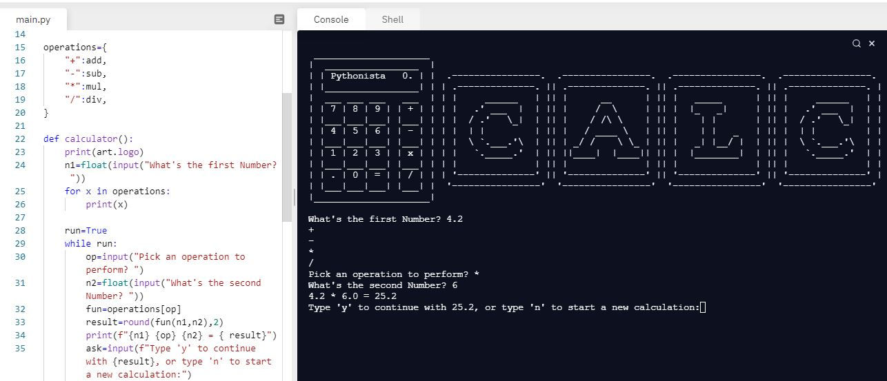

# Day-10

**Enough sleep = Enough Energy**.  **Functions with Outputs** was today's topic, wonderfully explain by [Dr.Angelea Yu](https://www.udemy.com/user/4b4368a3-b5c8-4529-aa65-2056ec31f37e/). 

### What did I learn?

1. ``` return``` keyword.
2. Multiple return statements.
3. Docstrings for documentation purpose.
4. recursion
5. [Days in a month](https://replit.com/@skandasharma/Days-in-Month)


## Project of the day

Happened to build a wonderful **Calculator** using functions, recursion and dictionaries. You can check out my code [here](https://replit.com/@skandasharma/calculator)

##### Screenshot



# Conclusion

To conclude, I would thank my instructor for being such a wonderful teacher for coming up with a beautiful course. I would like to thank **MYSELF** for being _self-motivated_ throughout the lecture. 

### Suggestion

- For all those who can understand English in a fast pace and catch up what the instructor is trying to convey can choose to watch the video at **1.2x** speed which reduces the watch time and meanwhile you can keep the remaining time for practice.

##### Date - 15/4/2021