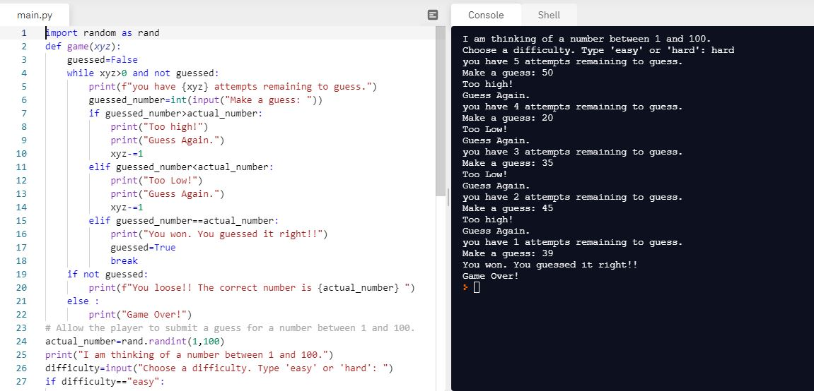

# Day-12

**Don't be too hard on yourself**.   Today's topic was **Scope and Namespace** which was indeed wonderfully explain by [Dr.Angelea Yu](https://www.udemy.com/user/4b4368a3-b5c8-4529-aa65-2056ec31f37e/). 

### What did I learn?

1. Scope of a variable 
2. Local Variable and Global Variable
3. Namespace in Python
4. Block Scope in Python
5. Global Constants

## Project of the day

Happened to build a wonderful **Number Guessing Game** using all the concepts mentioned above. You can check out my code [here](https://replit.com/@skandasharma/guess-the-number)

##### Screenshot

# Conclusion

To conclude, I would thank my instructor for being such a wonderful teacher for coming up with a beautiful course. I would like to thank **MYSELF** for being _self-motivated_ throughout the lecture. 

### Suggestion

- For all those who can understand English in a fast pace and catch up what the instructor is trying to convey can choose to watch the video at **1.2x** speed which reduces the watch time and meanwhile you can keep the remaining time for practice.

##### Date - 17/4/2021