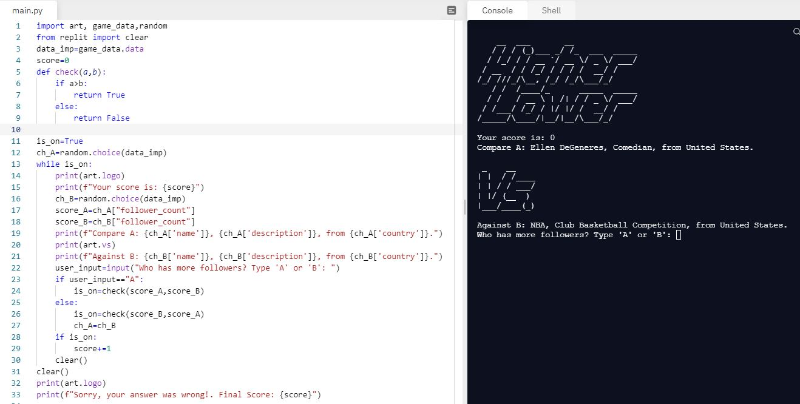

# Day-14

**Breaking Hurdles**.   Today's topic was **Higher-Lower Game** which was indeed wonderfully explain by [Dr.Angelea Yu](https://www.udemy.com/user/4b4368a3-b5c8-4529-aa65-2056ec31f37e/). 

### What did I learn?

1. Debugging.
2. Using all that I have studied past 13 days.

## Project of the day

**Higher-Lower Game** using Instagram followers as a dataset to compare celebrities and other public pages that have good amount of followers on Instagram. You can play my game [here](https://replit.com/@skandasharma/higher-lower) 

##### Screenshot

# Conclusion

To conclude, I would thank my instructor for being such a wonderful teacher for coming up with a beautiful course. I would like to thank **MYSELF** for being _self-motivated_ throughout the lecture. 

### Suggestion

- For all those who can understand English in a fast pace and catch up what the instructor is trying to convey can choose to watch the video at **1.2x** speed which reduces the watch time and meanwhile you can keep the remaining time for practice.

##### Date - 19/4/2021
