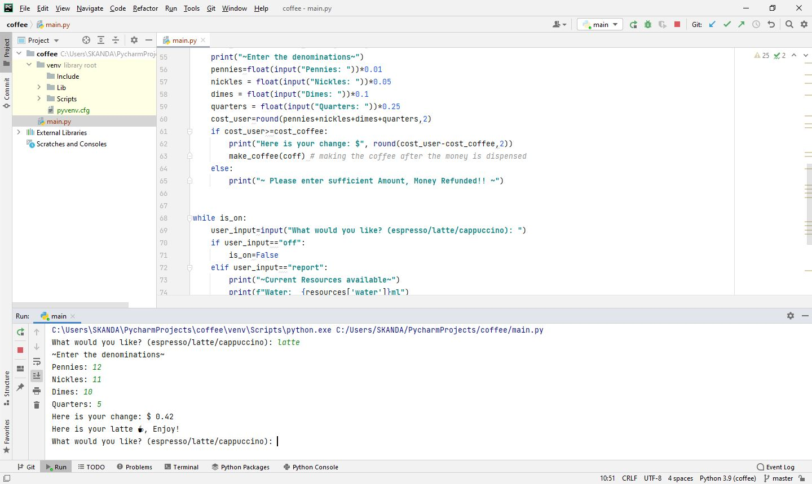

# Day-15

**Where you Study?**.   Today, I reached intermediate level of this challenge and feel excellent for which I would like to thank   [Dr.Angelea Yu](https://www.udemy.com/user/4b4368a3-b5c8-4529-aa65-2056ec31f37e/). 

### What did I learn?

1. Installing Python on local machine
2. Installing [PyCharm](https://www.jetbrains.com/pycharm/) - IDE for Python developed by JetBrains

## Project of the day

**Coffee Blending Machine** using all the concepts learnt till date. You can checkout my code [here](https://replit.com/@skandasharma/coffee-machine) 

##### Instructions to Use

1. Enter **Latte/Espresso/Cappuccino** to make coffee.
2. Enter denominations of coins.
3. To check the resources available, type **report**
4. To turn off the machine (end the program), type **off**

##### Screenshot

# Conclusion

To conclude, I would thank my instructor for being such a wonderful teacher for coming up with a beautiful course. I would like to thank **MYSELF** for being _self-motivated_ throughout the lecture. 

### Suggestion

- For all those who can understand English in a fast pace and catch up what the instructor is trying to convey can choose to watch the video at **1.2x** speed which reduces the watch time and meanwhile you can keep the remaining time for practice.

##### Date - 21/4/2021