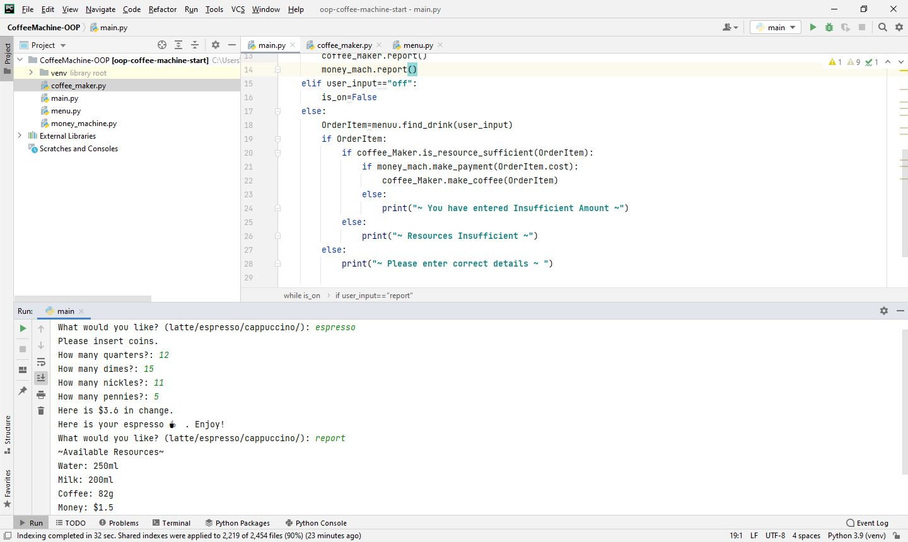

# Day-16

**Don't Forget to review your code regularly?**.   Today's topic was **Object Oriented Programming (OOP)**, which was wonderfully explained by   [Dr.Angelea Yu](https://www.udemy.com/user/4b4368a3-b5c8-4529-aa65-2056ec31f37e/). 

### What did I learn?

1. Classes and Objects in OOP.
2. Attributes and Methods in OOP.
3. [Turtle](https://docs.python.org/3/library/turtle.html) package.
4. **"."** (Dot) Operator
5. [PrettyTable](https://pypi.org/project/prettytable/) Package

## Project of the day

**Coffee Blending Machine** using OOP concepts. You can checkout my code [here](CoffeeMachine-OOP/main.py). You can also clone and run on local machine using an IDE. 

##### Instructions to Use

1. Enter **Latte/Espresso/Cappuccino** to make coffee.
2. Enter denominations of coins.
3. To check the resources available, type **report**
4. To turn off the machine (end the program), type **off**

##### Screenshot

# Conclusion

To conclude, I would thank my instructor for being such a wonderful teacher for coming up with a beautiful course. I would like to thank **MYSELF** for being _self-motivated_ throughout the lecture. 

### Suggestion

- For all those who can understand English in a fast pace and catch up what the instructor is trying to convey can choose to watch the video at **1.2x** speed which reduces the watch time and meanwhile you can keep the remaining time for practice.

##### Date - 22/4/2021