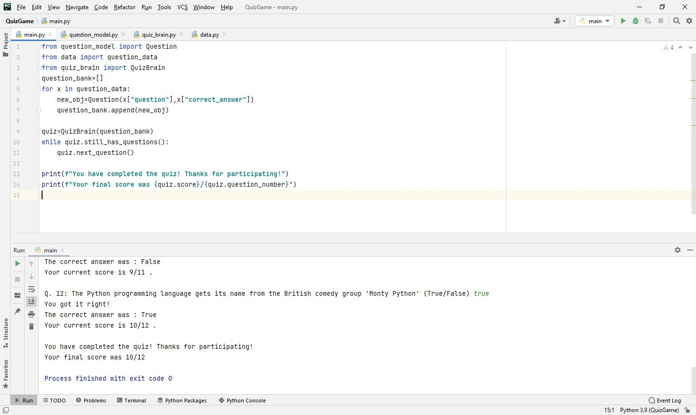

# Day-17

**Run a mile to reach your destination.**.   Today's topic was **Constructors in OOP**, which was wonderfully explained by   [Dr.Angelea Yu](https://www.udemy.com/user/4b4368a3-b5c8-4529-aa65-2056ec31f37e/). 

### What did I learn?

1. How to create a class using **class** keyword.
2. Constructor using ``` def __init__(self)``` method.
3. Adding attributes and methods inside class and passing parameters.

## Project of the day

**Quiz** using OOP concepts. You can checkout my code [here](QuizGame/main.py). You can also clone and run on local machine using an IDE. 

##### Instructions to Use

1. Enter either **True/False** as the answer and score 1 point on each correct answer.
2. You will receive the final score after all the questions are done.

##### Screenshot




# Conclusion

To conclude, I would thank my instructor for being such a wonderful teacher for coming up with a beautiful course. I would like to thank **MYSELF** for being _self-motivated_ throughout the lecture. 

### Suggestion

- For all those who can understand English in a fast pace and catch up what the instructor is trying to convey can choose to watch the video at **1.2x** speed which reduces the watch time and meanwhile you can keep the remaining time for practice.

##### Date - 23/4/2021