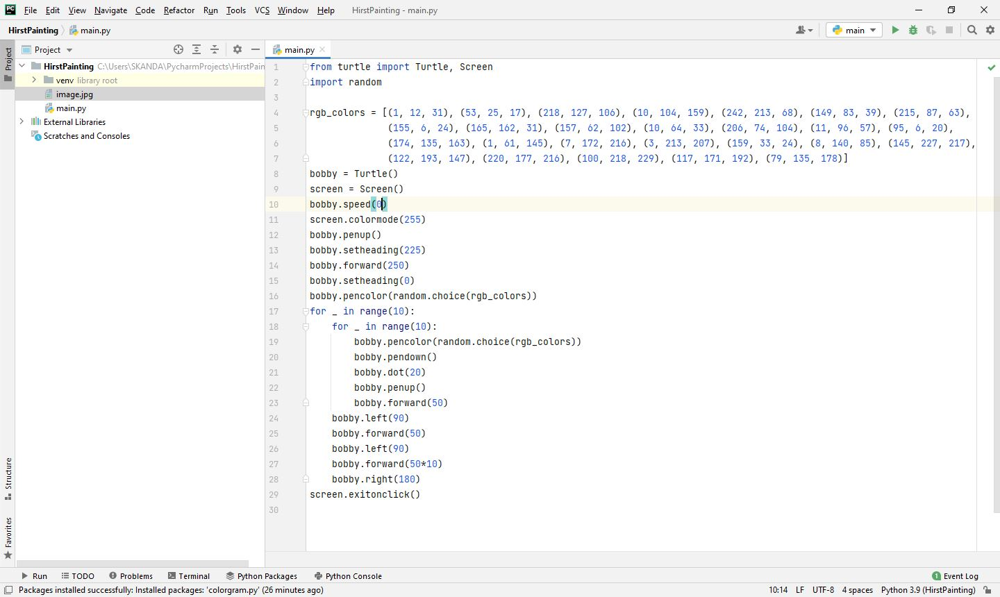

# Day-18

**Consistent and Concentration**.   Today's topic was **Tuples, Turtle package and Modules**, which was wonderfully explained by   [Dr.Angelea Yu](https://www.udemy.com/user/4b4368a3-b5c8-4529-aa65-2056ec31f37e/). 

### What did I learn?

1. Turtle Package.
2. from...import...
3. alias ``` import xyz as x```
4. Tuples in python ```abc=(1,3,7) ```
5. [Drawing a square using Turtle Package](https://replit.com/@skandasharma/Challenge-1)
6. [Dashed line using Turtle Package](https://replit.com/@skandasharma/Challenge-2)
7. [Drawing shapes of side 3 to 10](https://replit.com/@skandasharma/Challenge-3)
8. [Random Walk](https://replit.com/@skandasharma/Challenge-4)
9. [Spirograph](https://replit.com/@skandasharma/Challenge-5)


## Project of the day

**Hirst Spot Painting** using Turtle Package. You can checkout my code [here](HirstPainting/main.py). You can also clone and run on local machine using an IDE. 

##### Screenshot




# Conclusion

To conclude, I would thank my instructor for being such a wonderful teacher for coming up with a beautiful course. I would like to thank **MYSELF** for being _self-motivated_ throughout the lecture. 

### Suggestion

- For all those who can understand English in a fast pace and catch up what the instructor is trying to convey can choose to watch the video at **1.2x** speed which reduces the watch time and meanwhile you can keep the remaining time for practice.

##### Date - 24/4/2021