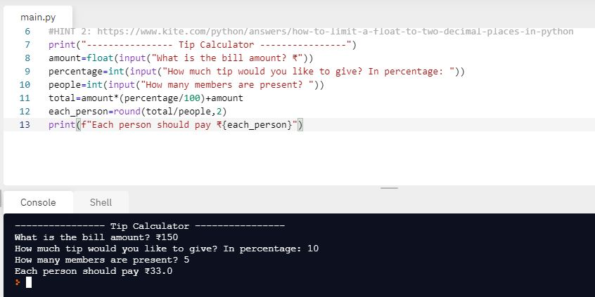

# How and When?

Ever wondered how did you end up here? Yes, _exactly_ it is surprising!! The reason behind me taking up this challenge was to commit myself into this **mission** which can be accomplished only through dedication and constant support from family and friends. 

When did I end up making that commitment ? I made it way long back and never had a change to **stick to it** thereby making it loose all  hope. 

##### Course: [100 days of code](https://www.udemy.com/share/103IHM/) 

##### Instructor: [Dr. Angela Yu](https://www.udemy.com/user/4b4368a3-b5c8-4529-aa65-2056ec31f37e/)    

# Day-2

It doesn't feel new to me anymore, used to this small segments of code that keeps me motivated and energized to learn more in short span of time.  

### What did I learn?

1. Data types in Python
2. Subscript of Strings
3. Type Function, Type Conversion
4. **PEMDAS** rule in maths
5. [BMI Calculator](https://replit.com/@skandasharma/BMI-Calculator) 
6. Number Manipulation 
7. **round()** function
8. **f string**
9. [Life in Weeks](https://replit.com/@skandasharma/Life-in-Weeks) = Excellent article by **Tim Urban**

## Project of the day

Using all the skills that I learnt in today's lecture, I am proud to announce that I made a **Tip Calculator** using strings and numbers. You can check out my code [here](https://replit.com/@skandasharma/tip-calculator). 

##### Screenshot

# Conclusion

To conclude, I would thank my instructor for being such a wonderful teacher for coming up with a beautiful course. I would like to thank **MYSELF** for being _self-motivated_ throughout the lecture. 

### Suggestion

- For all those who can understand English in a fast pace and catch up what the instructor is trying to convey can choose to watch the video at **1.2x** speed which reduces the watch time and meanwhile you can keep the remaining time for practice.