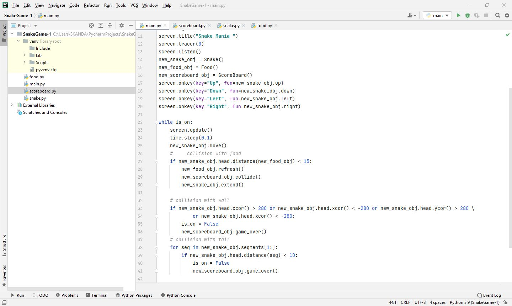

# Day-21

**Self Motivation is the key to Success**.   Today's topic was **Snake Game** using Turtle package, which was wonderfully explained by   [Dr.Angelea Yu](https://www.udemy.com/user/4b4368a3-b5c8-4529-aa65-2056ec31f37e/). 

### What did I learn?

Apart from developing the snake game I also happened to learn:

- Inheritance in python

- ```python
  # Slicing in Python
  a=[1,2,3,4,5]
  a[1:3]
  ```

*Here is the list of tasks to develop the Snake Game*

- [x] Create a Snake.
- [x] Move the Snake.
- [x] Control the snake.
- [x] Detect Collision with food.
- [x] Create a score board.
- [x] Detect collision with wall.
- [x] Detect collision with tail.


## Project of the day

**Snake Game** using Turtle Package. You can checkout my code [here](SnakeGame-1/main.py). You can also clone and run on local machine using an IDE. 

##### Screenshot




# Conclusion

To conclude, I would thank my instructor for being such a wonderful teacher for coming up with a beautiful course. I would like to thank **MYSELF** for being _self-motivated_ throughout the lecture. 

### Suggestion

- For all those who can understand English in a fast pace and catch up what the instructor is trying to convey can choose to watch the video at **1.2x** speed which reduces the watch time and meanwhile you can keep the remaining time for practice.

##### Date - 27/4/2021