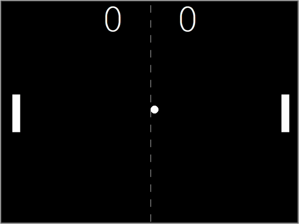

# Day-22

**Fear is your enemy**.   Today's topic was **Pong Game** using Turtle package, which was wonderfully explained by   [Dr.Angelea Yu](https://www.udemy.com/user/4b4368a3-b5c8-4529-aa65-2056ec31f37e/). 

### What did I learn?

*Here is the list of tasks to develop the Pong Game*

- [x] Create the screen.
- [x] Create and move paddle.
- [x] Create another paddle for multiplayer.
- [x] Create the ball and make it move.
- [x] Detect collision with wall and bounce.
- [x] Detect collision with paddle.
- [x] Detect when paddle misses to hit ball.
- [x] Score Board

## Project of the day

**Pong Game** using Turtle Package. You can checkout my code [here](PongGame/main.py). You can also clone and run on local machine using an IDE. 

#### How to play?

- Use **up** and **down** arrow to move right paddle.
- Use **W** and **S** keys to move left paddle.
- To win, you need to score **5 points**.

##### Screenshot

# Conclusion

To conclude, I would thank my instructor for being such a wonderful teacher for coming up with a beautiful course. I would like to thank **MYSELF** for being _self-motivated_ throughout the lecture. 

### Suggestion

- For all those who can understand English in a fast pace and catch up what the instructor is trying to convey can choose to watch the video at **1.2x** speed which reduces the watch time and meanwhile you can keep the remaining time for practice.

##### Date - 28/4/2021