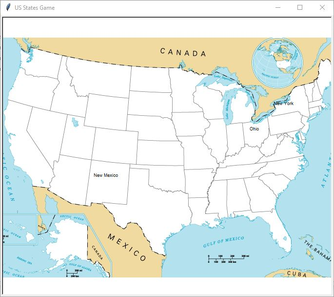

# Day-25

**Use your imagination to figure things**.   Today's topics was **CSV, Pandas Library** in python, which was wonderfully explained by   [Dr.Angelea Yu](https://www.udemy.com/user/4b4368a3-b5c8-4529-aa65-2056ec31f37e/). 

### What did I learn?

1. CSV package.
2. Pandas library: read_csv()
3. Series and Data Frame  

## Project of the day

**Guess the state** using Pandas Library. You can checkout my code [here](USStatesGame/main.py). You can also clone and run on local machine using an IDE. 

##### Screenshot

# Conclusion

To conclude, I would thank my instructor for being such a wonderful teacher for coming up with a beautiful course. I would like to thank **MYSELF** for being _self-motivated_ throughout the lecture. 

### Suggestion

- For all those who can understand English in a fast pace and catch up what the instructor is trying to convey can choose to watch the video at **1.2x** speed which reduces the watch time and meanwhile you can keep the remaining time for practice.

##### Date - 1/5/2021