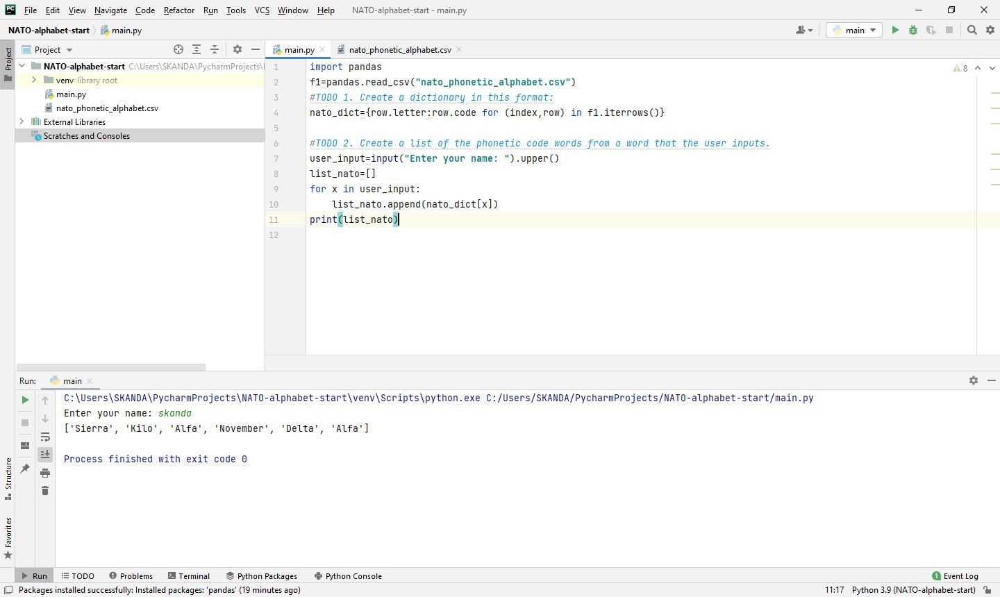

# Day-26

**Life is constant uncertainty. The only certainty is death.**   Today's topics was **List and Dictionary Comprehension** in python, which was wonderfully explained by   [Dr.Angelea Yu](https://www.udemy.com/user/4b4368a3-b5c8-4529-aa65-2056ec31f37e/). 

### What did I learn?

1. List Comprehension

   ```python
   new_list=[new_item for new_item in list]
   ```

2. List Comprehension support any sequences:  *list, range, string, tuple*

3. Conditional list comprehension

   ```python
   new_list=[new_item for new_item in list if condition]
   ```

4. Dictionary comprehension

   ```python
   new_dict={new_key:new_value for (new_key,new_value) in dict.items() if condition}
   ```


## Project of the day

**NATO Alphabet** using dictionary comprehension and Pandas library. You can checkout my code [here](NATOAlphabet/main.py). You can also clone and run on local machine using an IDE. 

##### Screenshot




# Conclusion

To conclude, I would thank my instructor for being such a wonderful teacher for coming up with a beautiful course. I would like to thank **MYSELF** for being _self-motivated_ throughout the lecture. 

### Suggestion

- For all those who can understand English in a fast pace and catch up what the instructor is trying to convey can choose to watch the video at **1.2x** speed which reduces the watch time and meanwhile you can keep the remaining time for practice.

##### Date - 2/5/2021