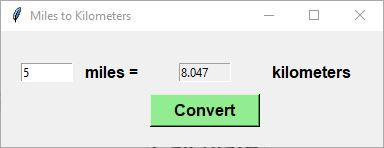

# Day-27

**Say no to TOXIC PEOPLE**   Today's topics was **GUI using Tkinter and function arguments** in python, which was wonderfully explained by   [Dr.Angelea Yu](https://www.udemy.com/user/4b4368a3-b5c8-4529-aa65-2056ec31f37e/). 

### What did I learn?

1. Tkinter package and it's classes: Tk, Button, Label, etc
2. Alignment of widgets on the window using **pack(), place() and grid()**

## Project of the day

**Miles to Kilometers convertor** using Tkinter package. You can checkout my code [here](MilesToKilometers/main.py). You can also clone and run on local machine using an IDE. 

##### Screenshot

# Conclusion

To conclude, I would thank my instructor for being such a wonderful teacher for coming up with a beautiful course. I would like to thank **MYSELF** for being _self-motivated_ throughout the lecture. 

### Suggestion

- For all those who can understand English in a fast pace and catch up what the instructor is trying to convey can choose to watch the video at **1.2x** speed which reduces the watch time and meanwhile you can keep the remaining time for practice.

##### Date - 3/5/2021