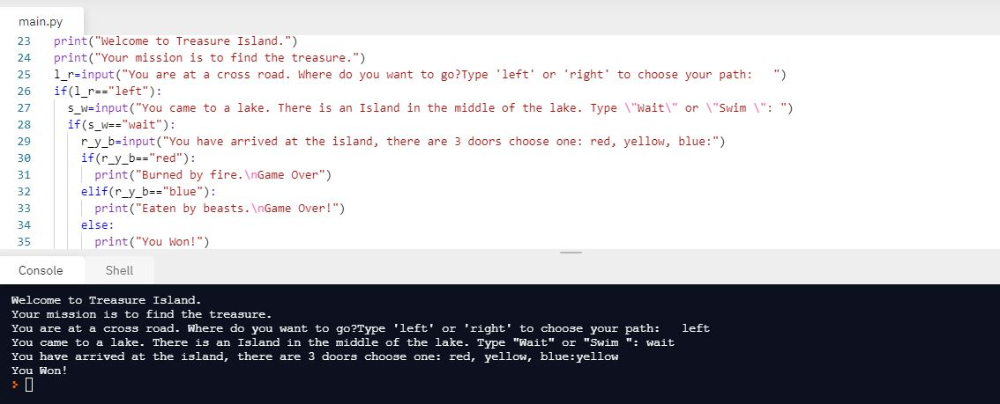

# Day-3

When we end up in a conflict, we sometimes see the consequences based on certain **Conditions** which in fact can be represented as a conditional statements in a programming language. It helps a lot in making small decisions based on certain criteria.

### What did I learn?

1. if/else statement
2. if....elif....else statement
3. Nested if statement
4. logical operators (<, >, <=, >=, ==, !=)
5. [Odd or Even](https://replit.com/@skandasharma/odd-or-even)
6. [Leap Year](https://replit.com/@skandasharma/Leap-Year)
7. Flowcharts using [Draw.io](https://app.diagrams.net/)
8. and, or, not (conditional operators)
9. [Pizza Price Calculator](https://replit.com/@skandasharma/Pizza-Price-Calculator)
10. [Love Calculator](https://replit.com/@skandasharma/Love-Calculator)

## Project of the day

Using all the skills that I learnt in today's lecture, I am proud to say that I made a **Treasure Island Game** using conditional statements. You can check out my code [here](https://replit.com/@skandasharma/treasure-island). 

##### Screenshot

# Conclusion

To conclude, I would thank my instructor for being such a wonderful teacher for coming up with a beautiful course. I would like to thank **MYSELF** for being _self-motivated_ throughout the lecture. 

### Suggestion

- For all those who can understand English in a fast pace and catch up what the instructor is trying to convey can choose to watch the video at **1.2x** speed which reduces the watch time and meanwhile you can keep the remaining time for practice.