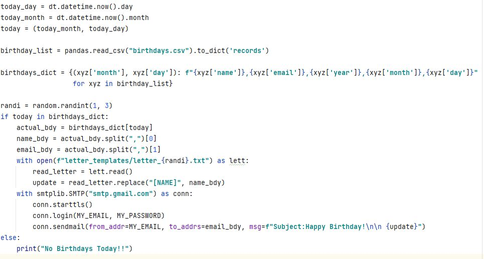

# Day-32

  Today's topics was **SMTPLIB and datetime modules** in python, which was wonderfully explained by   [Dr.Angelea Yu](https://www.udemy.com/user/4b4368a3-b5c8-4529-aa65-2056ec31f37e/). 

### What did I use?

1. Working of email and SMTP in general.
2. datetime module that has various methods to retrieve date, month and so on.
3. Hosting code online using [Python Anywhere](https://www.pythonanywhere.com/)

## Project of the day

**Automated Birthday Wisher** using the above mentioned topics. You can checkout my code [here](BirthdayWisher/main.py). You can also clone and run on local machine using an IDE. 

:warning:**Use your own email id and password in the place mentioned and also fill up the csv file with the given format.**

##### Screenshot

# Conclusion

To conclude, I would thank my instructor for being such a wonderful teacher for coming up with a beautiful course. I would like to thank **MYSELF** for being _self-motivated_ throughout the lecture. 

### Suggestion

- For all those who can understand English in a fast pace and catch up what the instructor is trying to convey can choose to watch the video at **1.2x** speed which reduces the watch time and meanwhile you can keep the remaining time for practice.

##### Date - 13/5/2021
