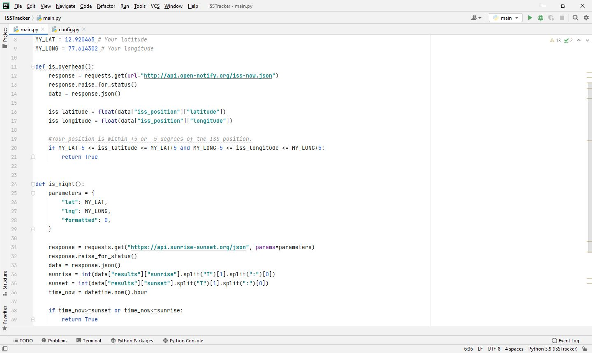

# Day-33

  **Watch out!** Today's topics was **API and requests module** in python, which was wonderfully explained by   [Dr.Angelea Yu](https://www.udemy.com/user/4b4368a3-b5c8-4529-aa65-2056ec31f37e/). 

### What did I use?

1. API = **A**pplication **P**rogramming **I**nterface, acts as a middleware between native application and external application.
2. Reading status code and json from API requests.
3. API Endpoint, API Calls.
4. Passing parameters into API requests.

## Project of the day

**ISS Tracker** using the above mentioned topics. You can checkout my code [here](ISSTracker/main.py). You can also clone and run on local machine using an IDE. 

:warning:**Use your own email id and password as well as change latitude and longitude as per your preference.**

##### Screenshot

# Conclusion

To conclude, I would thank my instructor for being such a wonderful teacher for coming up with a beautiful course. I would like to thank **MYSELF** for being _self-motivated_ throughout the lecture. 

### Suggestion

- For all those who can understand English in a fast pace and catch up what the instructor is trying to convey can choose to watch the video at **1.2x** speed which reduces the watch time and meanwhile you can keep the remaining time for practice.

##### Date - 14/5/2021