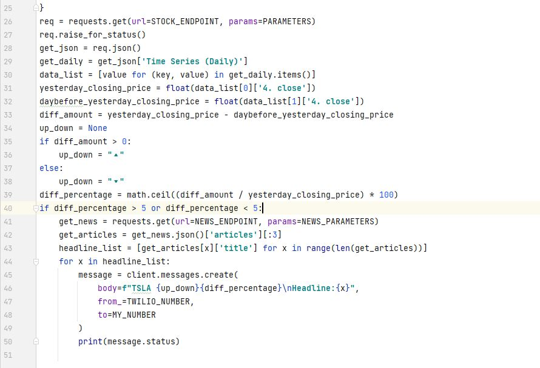
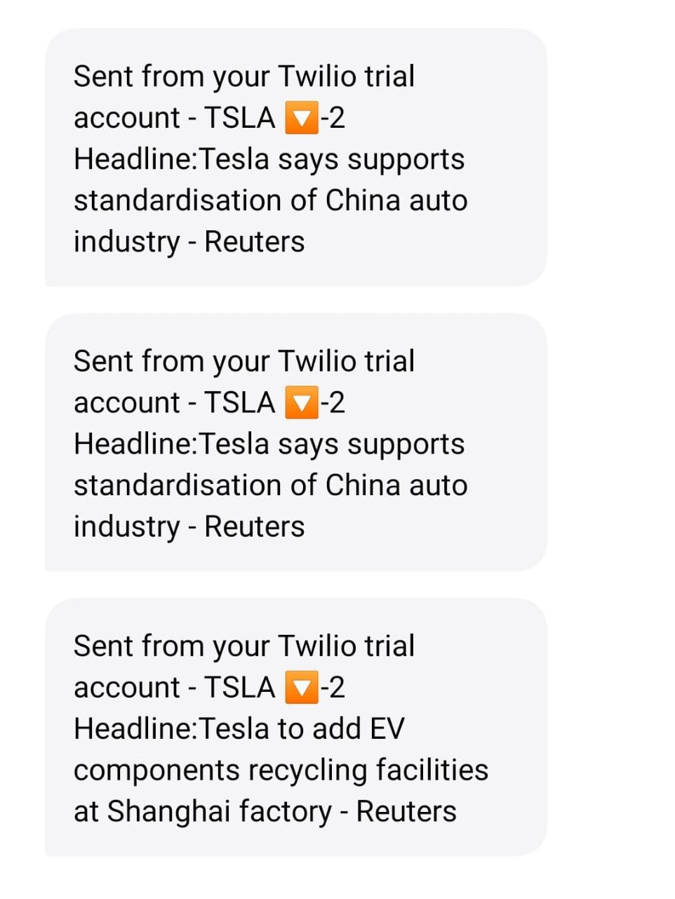

# Day-36

 Today's topic was **Stock Market Alert** in python, which was wonderfully explained by   [Dr.Angelea Yu](https://www.udemy.com/user/4b4368a3-b5c8-4529-aa65-2056ec31f37e/). 

### What did I use?

*Using all that I have learnt past 1 week regarding list comprehension, API and more.*

**I have used the below APIs and you can get your own API Key:**

1. [Alphavantage](https://www.alphavantage.co/) - Stock Market Analysis
2. [NewsApi](https://newsapi.org/) - News Updates
3. [Twilio](https://www.twilio.com/) - to send SMS

## Project of the day

**Stock Market Alert** using the above mentioned topics. You can checkout my code [here](StockNewsAlert/main.py). You can also clone and run on local machine using an IDE. 

**:information_source: You will need to enter your own API KEY, auth token and phone numbers.**

##### Screenshot

**Code**

**SMS Received**

# Conclusion

To conclude, I would thank my instructor for being such a wonderful teacher for coming up with a beautiful course. I would like to thank **MYSELF** for being _self-motivated_ throughout the lecture. 

### Suggestion

- For all those who can understand English in a fast pace and catch up what the instructor is trying to convey can choose to watch the video at **1.2x** speed which reduces the watch time and meanwhile you can keep the remaining time for practice.

##### Date - 18/5/2021