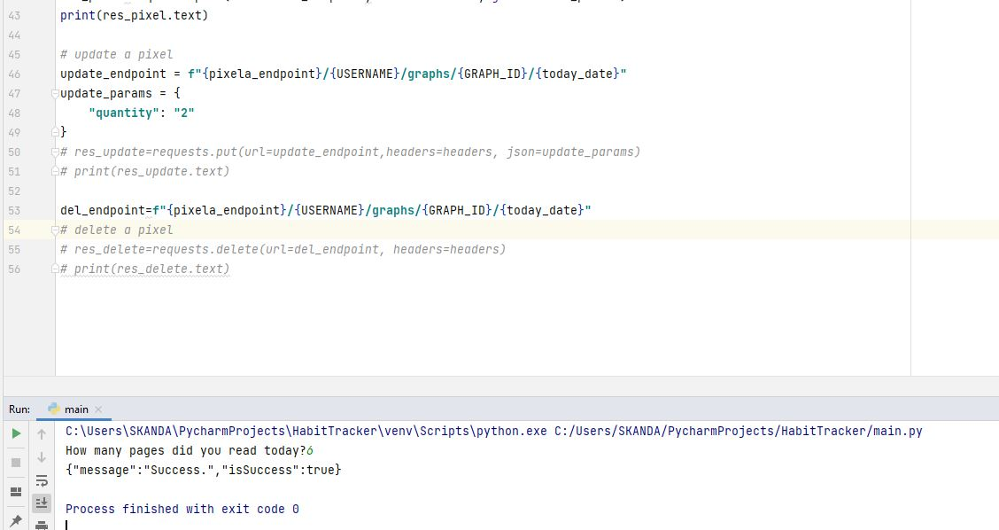
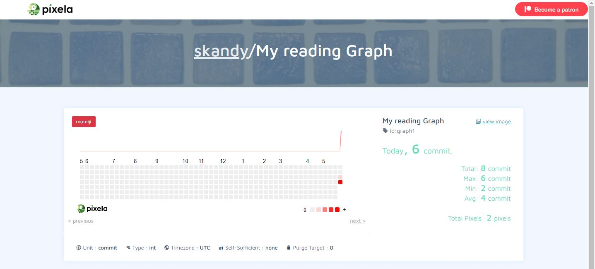

# Day-37

 Today's topics was **Advance Authentication, POST/ PUT/ DELETE requests ** in python, which was wonderfully explained by   [Dr.Angelea Yu](https://www.udemy.com/user/4b4368a3-b5c8-4529-aa65-2056ec31f37e/). 

### What did I use?

1. HTTP headers that are used to pass over confidential data across the internet.
2. [Pixela API](https://pixe.la/index.html) used to track my habit.

## Project of the day

**Habit Tracker** using the above mentioned topics. You can checkout my code [here](HabitTracker/main.py). You can also clone and run on local machine using an IDE. 

**:information_source: You will need to enter your own API KEY/ Token.**

##### Screenshot

**Code**

**Graph**

# Conclusion

To conclude, I would thank my instructor for being such a wonderful teacher for coming up with a beautiful course. I would like to thank **MYSELF** for being _self-motivated_ throughout the lecture. 

### Suggestion

- For all those who can understand English in a fast pace and catch up what the instructor is trying to convey can choose to watch the video at **1.2x** speed which reduces the watch time and meanwhile you can keep the remaining time for practice.

##### Date - 19/5/2021