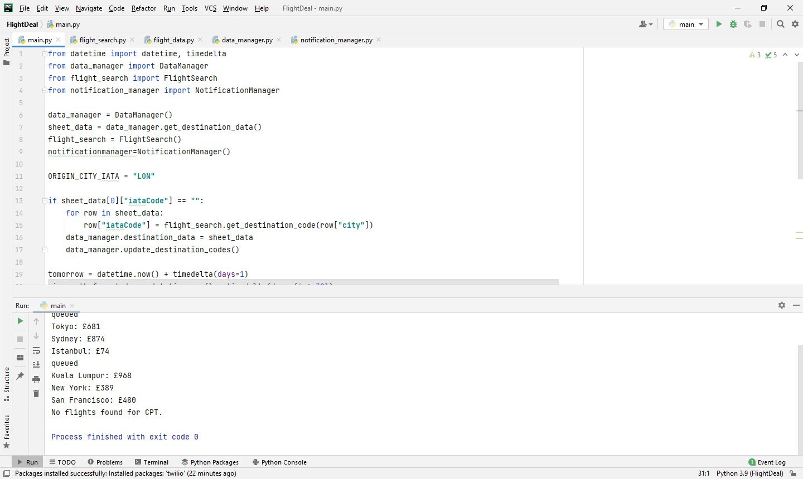
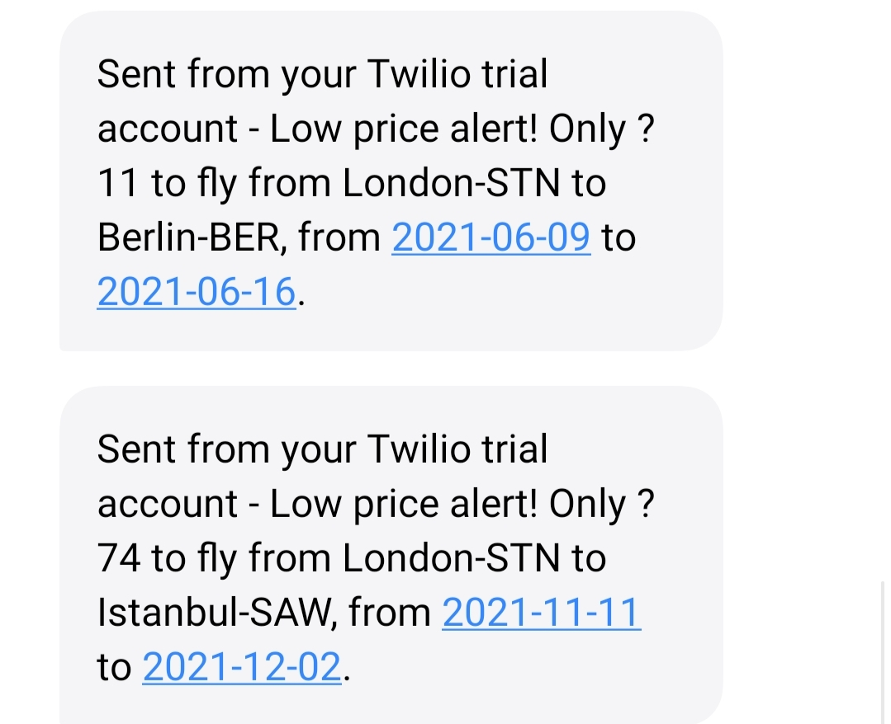

# Day-39

 Today's topic was **Capstone Project - Flight Deal Finder** in python, which was wonderfully explained by   [Dr.Angelea Yu](https://www.udemy.com/user/4b4368a3-b5c8-4529-aa65-2056ec31f37e/). 

### What did I use?

*Worked on various topics that were covered past few days. I used the following APIs to make this project happen:*

1. [Tequila](https://tequila.kiwi.com/) used to make flight searches.
2. [Sheety](https://sheety.co/) used to integrate google sheets with our application.
3. [Twilio](https://www.twilio.com/) used to send SMS.

## Project of the day

**Flight Deal Finder - 1** using the above mentioned topics. You can checkout my code [here](FlightDeal/main.py). You can also clone and run on local machine using an IDE. 

**:information_source: You will need to enter your own API KEY/ Token in [keys.py](FlightDeal/keys.py) file **

##### Screenshot

**Code**

**SMS**

# Conclusion

To conclude, I would thank my instructor for being such a wonderful teacher for coming up with a beautiful course. I would like to thank **MYSELF** for being _self-motivated_ throughout the lecture. 

### Suggestion

- For all those who can understand English in a fast pace and catch up what the instructor is trying to convey can choose to watch the video at **1.2x** speed which reduces the watch time and meanwhile you can keep the remaining time for practice.

##### Date - 21/5/2021