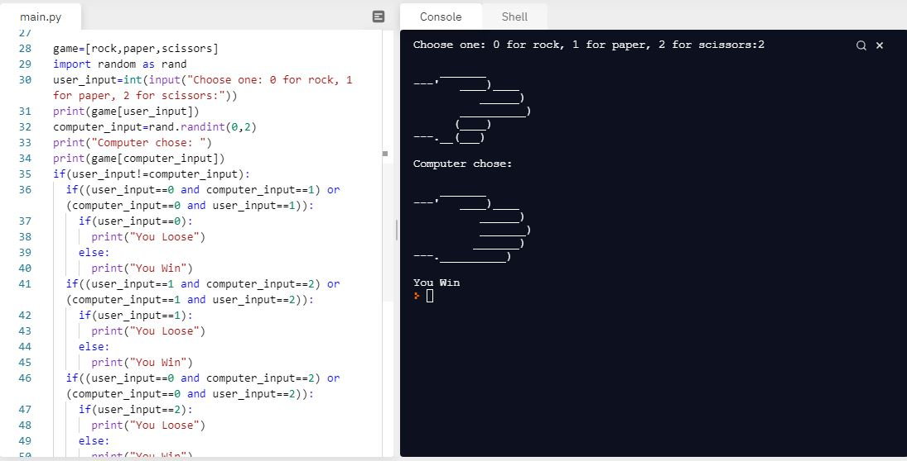

# Day-4

**Programming is like Gym** you need to workout every single day to achieve something big. This is similar to taking **small steps** for big success. **Randomization and Lists** were today's topic, wonderfully explain by [Dr.Angelea Yu](https://www.udemy.com/user/4b4368a3-b5c8-4529-aa65-2056ec31f37e/) 

### What did I learn?

1. Modules => Import and Export
2. _Random_ Module
3. randint(a,b) function
4. [Head or Tails](https://replit.com/@skandasharma/Heads-or-tails)
5. Lists => Data Structure in Python using append(), extend(), etc.
6. Index Errors and Nested lists
7. [Who is Paying the bill?](https://replit.com/@skandasharma/who-is-paying)
8. [Treasure Map](https://replit.com/@skandasharma/Treasure-Map) 

## Project of the day

Using all the skills that I learnt in today's lecture, I am proud to say that I made a **Rock, Papers, Scissors game** using random module and lists. You can check out my code [here](https://replit.com/@skandasharma/rock-paper-scissors). 

##### Screenshot

# Conclusion

To conclude, I would thank my instructor for being such a wonderful teacher for coming up with a beautiful course. I would like to thank **MYSELF** for being _self-motivated_ throughout the lecture. 

### Suggestion

- For all those who can understand English in a fast pace and catch up what the instructor is trying to convey can choose to watch the video at **1.2x** speed which reduces the watch time and meanwhile you can keep the remaining time for practice.