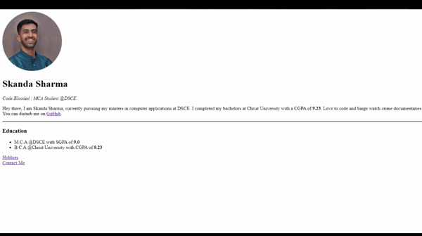

# Day-41

**HTML and CSS** is what I will be going to learn for few days as it is necessary for the upcoming lectures. First 4 modules of [The Complete 2021 Web Development Bootcamp](https://www.udemy.com/course/the-complete-web-development-bootcamp/) by  [Dr.Angelea Yu](https://www.udemy.com/user/4b4368a3-b5c8-4529-aa65-2056ec31f37e/). 

### What did I learn?

1. Working of internet, usage of HTML, CSS and JS.

2. HTML tags and attributes.

3. Worked on

   ```html
    <!-- Image tag -->
   <a href="..."></a><!-- Anchor tag -->
   <ul><!-- Unordered list tag -->
       <li>...</li>
   </ul>
   <ol><!-- Ordered list tag -->
       <li>...</li>
   </ol>
   ```

   

## Project of the day

**Portfolio** using the above mentioned topics. You can checkout my code [here](Website-1/index.html). 

##### Screenshot



# Conclusion

To conclude, I would thank my instructor for being such a wonderful teacher for coming up with a beautiful course. I would like to thank **MYSELF** for being _self-motivated_ throughout the lecture. 

### Suggestion

- For all those who can understand English in a fast pace and catch up what the instructor is trying to convey can choose to watch the video at **1.25x** speed which reduces the watch time and meanwhile you can keep the remaining time for practice.

##### Date - 23/5/2021