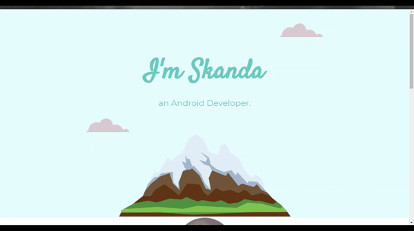

# Day-44

**HTML and CSS** is what I will be going to learn for few days as it is necessary for the upcoming lectures. First 4 modules of [The Complete 2021 Web Development Bootcamp](https://www.udemy.com/course/the-complete-web-development-bootcamp/) by  [Dr.Angelea Yu](https://www.udemy.com/user/4b4368a3-b5c8-4529-aa65-2056ec31f37e/). 

### What did I learn?

1. [Favicons](https://favicon.io/) get your own version of favicon.

2. HTML DIV 

   ```html
   <div>
       ...
   </div>
   ```

3. Box Model in CSS.

4. display property : block, inline, inline-block, none.

5. Position property : static, relative, absolute, fixed.

6. Font styling using CSS.

7. CSS sizing.

8. Float property.

## Project of the day

**Portfolio** using the above mentioned topics. You can checkout my code [here](Website-2/index.html). 

##### Screenshot



# Conclusion

To conclude, I would thank my instructor for being such a wonderful teacher for coming up with a beautiful course. I would like to thank **MYSELF** for being _self-motivated_ throughout the lecture. 

### Suggestion

- For all those who can understand English in a fast pace and catch up what the instructor is trying to convey can choose to watch the video at **1.25x** speed which reduces the watch time and meanwhile you can keep the remaining time for practice.

##### Date - 26/5/2021