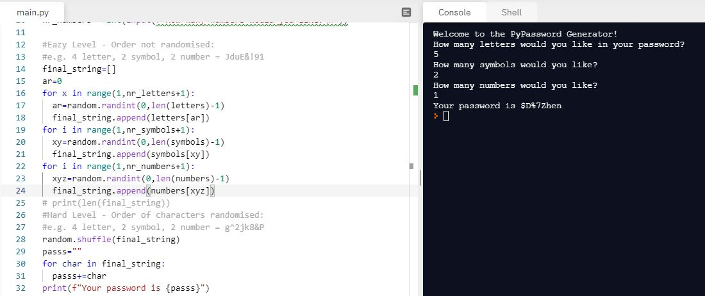

# Day-5

**Hard work and Perseverance beats raw talent!! **. **Loops** was today's topic, wonderfully explain by [Dr.Angelea Yu](https://www.udemy.com/user/4b4368a3-b5c8-4529-aa65-2056ec31f37e/) 

### What did I learn?

1. for loop ```for item in list```
2. using range() ```for i in range(a,b)```
3. [Average of Heights](https://replit.com/@skandasharma/Average-of-Heights)
4. [Highest Score in the class](https://replit.com/@skandasharma/Highest-Score-in-the-class)
5. [Sum of Even numbers](https://replit.com/@skandasharma/Sum-of-even-numbers-from-1-to-100)
6. [FizzBuzz](https://replit.com/@skandasharma/Fizz-Buzz)

## Project of the day

Using all the skills that I learnt in today's lecture, I am proud to say that I made a **Random Password Generator** using random module, lists and for loop. You can check out my code [here](https://replit.com/@skandasharma/password-generator). 

##### Screenshot



# Conclusion

To conclude, I would thank my instructor for being such a wonderful teacher for coming up with a beautiful course. I would like to thank **MYSELF** for being _self-motivated_ throughout the lecture. 

### Suggestion

- For all those who can understand English in a fast pace and catch up what the instructor is trying to convey can choose to watch the video at **1.2x** speed which reduces the watch time and meanwhile you can keep the remaining time for practice.
