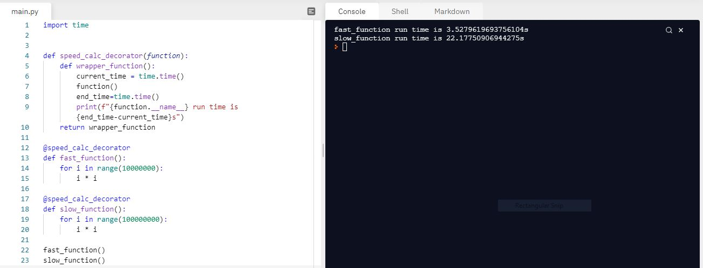

# Day-54

Today's topic was **Flask Framework** in python which was wonderfully explained by  [Dr.Angelea Yu](https://www.udemy.com/user/4b4368a3-b5c8-4529-aa65-2056ec31f37e/). 

### What did I learn?

1. Flask framework used to run a server and create web application.
2. Difference between library and framework.
3. Python Decorators, nested functions.
4. Syntactic sugar.

## Project of the day

**Challenge using Decorators** using the above mentioned topics. Feel free to fork your own copy or modify the same [here](https://replit.com/join/probnvwver-skandasharma). 

##### Screenshot

# Conclusion

To conclude, I would thank my instructor for being such a wonderful teacher for coming up with a beautiful course. I would like to thank **MYSELF** for being _self-motivated_ throughout the lecture. 

### Suggestion

- For all those who can understand English in a fast pace and catch up what the instructor is trying to convey can choose to watch the video at **1.25x** speed which reduces the watch time and meanwhile you can keep the remaining time for practice.

##### Date - 9/6/2021