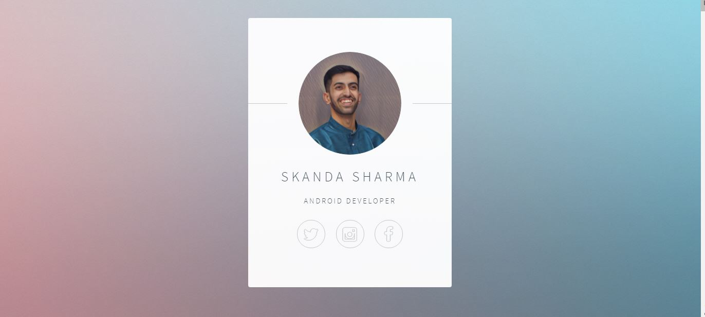

# Day-56

Today's topic was **Flask Framework** in python which was wonderfully explained by  [Dr.Angelea Yu](https://www.udemy.com/user/4b4368a3-b5c8-4529-aa65-2056ec31f37e/). 

### What did I learn?

1. Rendering CSS into flask.
2. Image rendering and directory structure of flask framework.
3. Templates and static folder.

## Project of the day

**Personal Card** using the above mentioned topics. You can check out my code [here](MyPersonalCard/server.py). 

##### Screenshot

# Conclusion

To conclude, I would thank my instructor for being such a wonderful teacher for coming up with a beautiful course. I would like to thank **MYSELF** for being _self-motivated_ throughout the lecture. 

### Suggestion

- For all those who can understand English in a fast pace and catch up what the instructor is trying to convey can choose to watch the video at **1.25x** speed which reduces the watch time and meanwhile you can keep the remaining time for practice.

##### Date - 14/6/2021