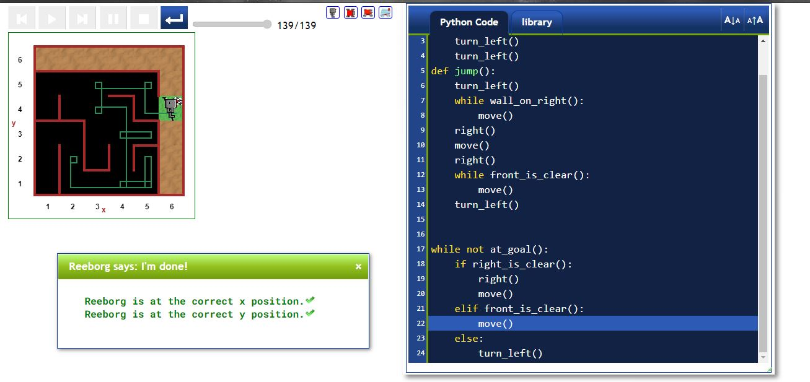

# Day-6

**Is it really so hard to code? NO**.  **Functions, Code Blocks and While loop** were today's topic, wonderfully explain by [Dr.Angelea Yu](https://www.udemy.com/user/4b4368a3-b5c8-4529-aa65-2056ec31f37e/) 

### What did I learn?

1. Defining and calling a function ``` def function ():``` 
2. Code Blocks
3. Indentation
4. while loop ```while true:```

## Project of the day

Haven't done any project for the day, you can check out  [Reedborg's World](https://reeborg.ca/reeborg.html?lang=en&mode=python&menu=worlds%2Fmenus%2Freeborg_intro_en.json&name=Alone&url=worlds%2Ftutorial_en%2Falone.json). Try solving the hurdles one by one using function, loops and conditional statements.

##### Screenshot



# Conclusion

To conclude, I would thank my instructor for being such a wonderful teacher for coming up with a beautiful course. I would like to thank **MYSELF** for being _self-motivated_ throughout the lecture. 

### Suggestion

- For all those who can understand English in a fast pace and catch up what the instructor is trying to convey can choose to watch the video at **1.2x** speed which reduces the watch time and meanwhile you can keep the remaining time for practice.

##### Date - 10/4/2021