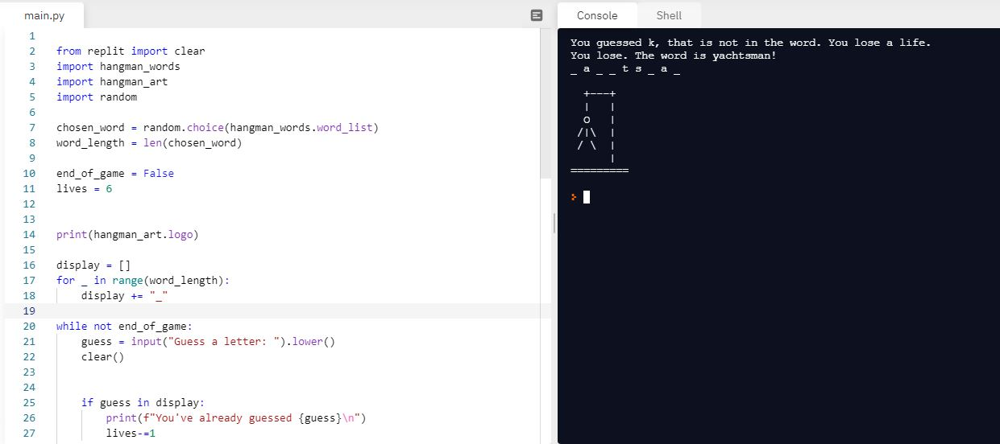

# Day-7

**Daily Practice is a must!**.  **Loops, Modules, Random and Lists** were today's topic, wonderfully explain by [Dr.Angelea Yu](https://www.udemy.com/user/4b4368a3-b5c8-4529-aa65-2056ec31f37e/). It was overwhelming to have a revision of all the topics learnt in one week. 

### What did I learn?

- [Hangman Game](https://en.wikipedia.org/wiki/Hangman_(game))
- Working on random and lists in Python
- Breaking huge problem into small problems and solving each.

## Project of the day

Happened to build a wonderful Hangman game using all the concepts learnt during this one week of lecture. You can check out my code [here](https://replit.com/@skandasharma/Day-7-Hangman-Final).

##### Screenshot

# Conclusion

To conclude, I would thank my instructor for being such a wonderful teacher for coming up with a beautiful course. I would like to thank **MYSELF** for being _self-motivated_ throughout the lecture. 

### Suggestion

- For all those who can understand English in a fast pace and catch up what the instructor is trying to convey can choose to watch the video at **1.2x** speed which reduces the watch time and meanwhile you can keep the remaining time for practice.

##### Date - 12/4/2021