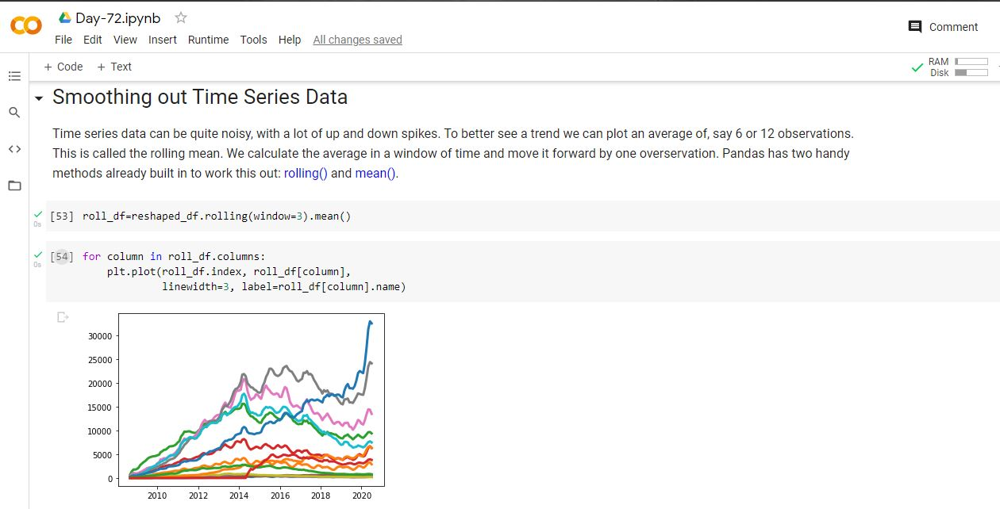

# Day-72

 Today's topic was **MatPlotLib** which was wonderfully explained by  [Dr.Angelea Yu](https://www.udemy.com/user/4b4368a3-b5c8-4529-aa65-2056ec31f37e/). 

### What did I learn?

1. used `.groupby()` to explore the number of posts and entries per programming language
2. converted strings to Datetime objects with `to_datetime()` for easier plotting
3. reshaped our DataFrame by converting categories to columns using `.pivot()`
4. used `.count()` and `isna().values.any()` to look for NaN values in our DataFrame, which we then replaced using `.fillna()`
5. created (multiple) line charts using `.plot()` with a for-loop
6. styled our charts by changing the size, the labels, and the upper and lower bounds of our axis.
7. added a legend to tell apart which line is which by colour
8. smoothed out our time-series observations with `.rolling().mean()` and plotted them to better identify trends over time.

## Project of the day

**Exploring Data and Plotting Graphs** using the above mentioned topics. You can check out my project [here](https://drive.google.com/file/d/1B2AH_ZOwJpqmNIu0QQcmMsUvH7qVqhxH/view?usp=sharing).  

##### **Screenshot**

# Conclusion

To conclude, I would thank my instructor for being such a wonderful teacher for coming up with a beautiful course. I would like to thank **MYSELF** for being _self-motivated_ throughout the lecture. 

### Suggestion

- For all those who can understand English in a fast pace and catch up what the instructor is trying to convey can choose to watch the video at **1.25x** speed which reduces the watch time and meanwhile you can keep the remaining time for practice.

##### Date - 19/8/2021