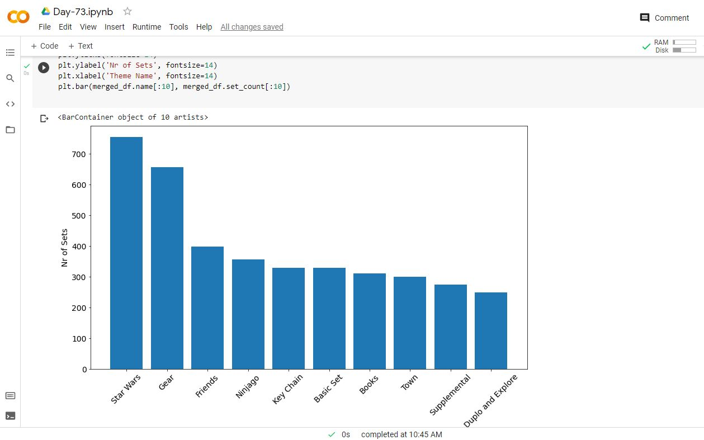

# Day-73

 Today's topic was **Scatter Plot and Bar Chart** which was wonderfully explained by  [Dr.Angelea Yu](https://www.udemy.com/user/4b4368a3-b5c8-4529-aa65-2056ec31f37e/). 

### What did I learn?

1. use HTML Markdown in Notebooks, such as section headings `#` and how to embed images with the `` tag.
2. combine the `groupby()` and `count()` functions to aggregate data
3. use the `.value_counts()` function
4. slice DataFrames using the square bracket notation e.g., `df[:-2]` or `df[:10]`
5. use the `.agg()` function to run an operation on a particular column
6. `rename()` columns of DataFrames
7. create a line chart with two separate axes to visualise data that have different scales.
8. create a scatter plot in Matplotlib
9. work with tables in a relational database by using primary and foreign keys
10. `.merge()` DataFrames along a particular column
11. create a bar chart with Matplotlib

## Project of the day

**LEGO Analysis** using the above mentioned topics. You can check out my project [here](https://drive.google.com/file/d/1OY5EITcgxnCLSOhHPoNu7AsOf_S4lo_f/view?usp=sharing).  

##### **Screenshot**

# Conclusion

To conclude, I would thank my instructor for being such a wonderful teacher for coming up with a beautiful course. I would like to thank **MYSELF** for being _self-motivated_ throughout the lecture. 

### Suggestion

- For all those who can understand English in a fast pace and catch up what the instructor is trying to convey can choose to watch the video at **1.25x** speed which reduces the watch time and meanwhile you can keep the remaining time for practice.

##### Date - 20/8/2021