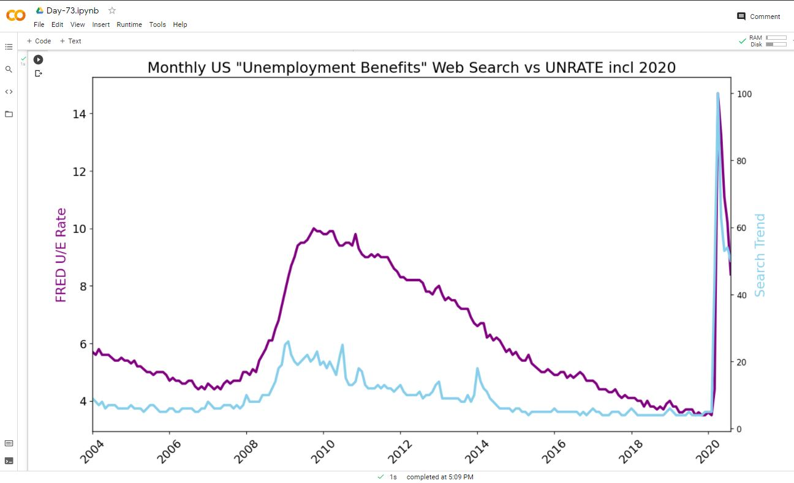

# Day-74

 Today's topic was **Tesla Price, Unemployment in U.S, Crisis** which was wonderfully explained by  [Dr.Angelea Yu](https://www.udemy.com/user/4b4368a3-b5c8-4529-aa65-2056ec31f37e/). 

### What did I learn?

1. How to use `.describe()` to quickly see some descriptive statistics at a glance.
2. How to use `.resample()` to make a time-series data comparable to another by changing the periodicity.
3. How to work with `matplotlib.dates` Locators to better style a timeline (e.g., an axis on a chart).
4. How to find the number of NaN values with `.isna().values.sum()`
5. How to change the resolution of a chart using the figure's `dpi`
6. How to create dashed `'--'` and dotted `'-.'` lines using `linestyles`
7. How to use different kinds of markers (e.g., `'o'` or `'^'`) on charts.
8. Fine-tuning the styling of Matplotlib charts by using limits, labels, `linewidth` and colours (both in the form of named colours and HEX codes).
9. Using `.grid()` to help visually identify seasonality in a time series.

## Project of the day

**Time Series data** using the above mentioned topics. You can check out my project [here](https://drive.google.com/file/d/1kXgRU75ITqSuI4saLyPL_fSfINCqHGE4/view?usp=sharing).  

##### **Screenshot**

# Conclusion

To conclude, I would thank my instructor for being such a wonderful teacher for coming up with a beautiful course. I would like to thank **MYSELF** for being _self-motivated_ throughout the lecture. 

### Suggestion

- For all those who can understand English in a fast pace and catch up what the instructor is trying to convey can choose to watch the video at **1.25x** speed which reduces the watch time and meanwhile you can keep the remaining time for practice.

##### Date - 21/8/2021