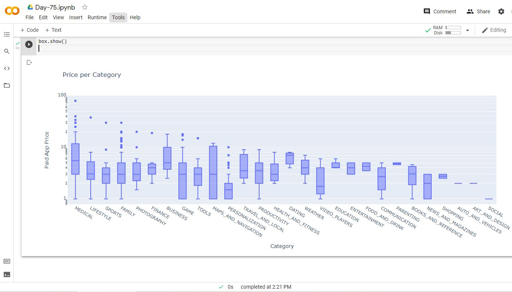

# Day-75

 Today's topic was **Google Play Store Apps Analysis** which was wonderfully explained by  [Dr.Angelea Yu](https://www.udemy.com/user/4b4368a3-b5c8-4529-aa65-2056ec31f37e/). 

### What did I learn?

1. Pull a random sample from a DataFrame using `.sample()`
2. How to find duplicate entries with `.duplicated()` and `.drop_duplicates()`
3. How to convert string and object data types into numbers with `.to_numeric()`
4. How to use plotly to generate beautiful pie, donut, and bar charts as well as box and scatter plots

## Project of the day

**Plotting Graphs** using the above mentioned topics. You can check out my project [here](https://drive.google.com/file/d/1LtV-yoISQ_0AbohQqVLHLq5vjuwHxshW/view?usp=sharing).  

##### **Screenshot**

# Conclusion

To conclude, I would thank my instructor for being such a wonderful teacher for coming up with a beautiful course. I would like to thank **MYSELF** for being _self-motivated_ throughout the lecture. 

### Suggestion

- For all those who can understand English in a fast pace and catch up what the instructor is trying to convey can choose to watch the video at **1.25x** speed which reduces the watch time and meanwhile you can keep the remaining time for practice.

##### Date - 23/8/2021