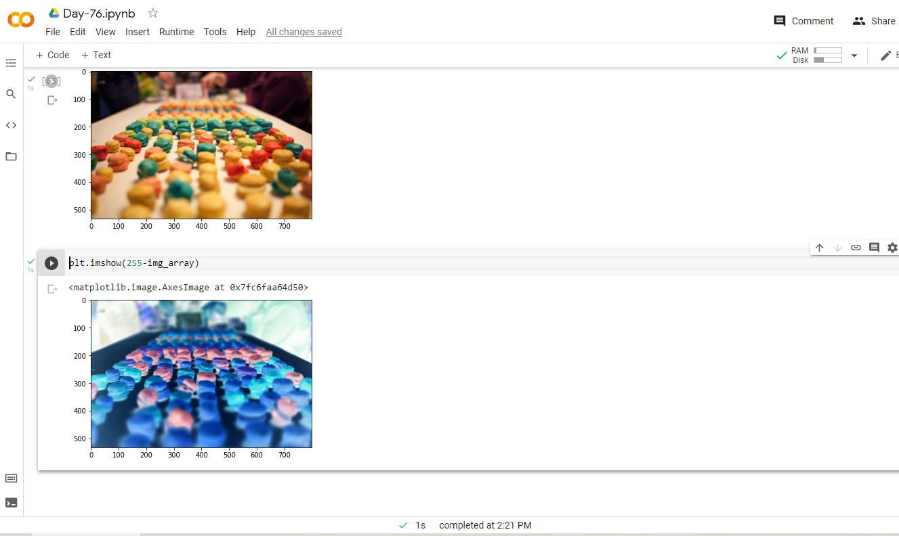

# Day-76

 Today's topic was **NumPy** which was wonderfully explained by  [Dr.Angelea Yu](https://www.udemy.com/user/4b4368a3-b5c8-4529-aa65-2056ec31f37e/). 

### What did I learn?

1. Create arrays manually with `np.array()`
2. Generate arrays using `.arange()`, `.random()`, and `.linspace()`
3. Analyse the shape and dimensions of a ndarray
4. Slice and subset a ndarray based on its indices
5. Do linear algebra like operations with scalars and matrix multiplication
6. Use NumPys broadcasting to make ndarray shapes compatible
7. Manipulate images in the form of ndarrays.

## Project of the day

**Image Processing** using the above mentioned topics. You can check out my project [here](https://drive.google.com/file/d/1djhkAXU6Y-K1SBJmWzITsH-gSHO8EFT8/view?usp=sharing).  

##### **Screenshot**

# Conclusion

To conclude, I would thank my instructor for being such a wonderful teacher for coming up with a beautiful course. I would like to thank **MYSELF** for being _self-motivated_ throughout the lecture. 

### Suggestion

- For all those who can understand English in a fast pace and catch up what the instructor is trying to convey can choose to watch the video at **1.25x** speed which reduces the watch time and meanwhile you can keep the remaining time for practice.

##### Date - 24/8/2021