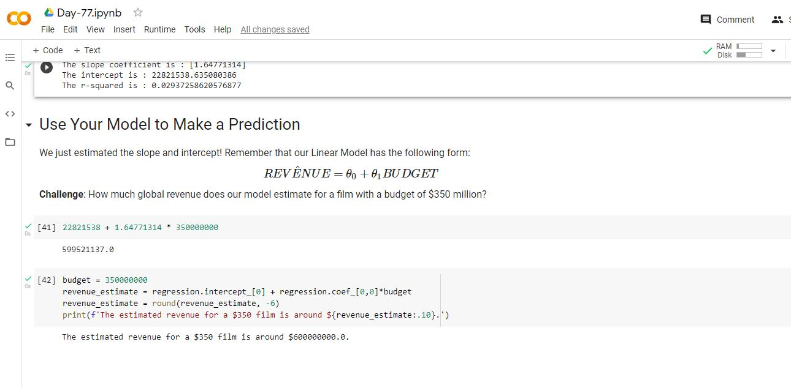

# Day-77

 Today's topic was **Seaborn** which was wonderfully explained by  [Dr.Angelea Yu](https://www.udemy.com/user/4b4368a3-b5c8-4529-aa65-2056ec31f37e/). 

### What did I learn?

1. Use nested loops to remove unwanted characters from multiple columns
2. Filter Pandas DataFrames based on multiple conditions using both `.loc[]` and `.query()`
3. Create bubble charts using the Seaborn Library
4. Style Seaborn charts using the pre-built styles and by modifying Matplotlib parameters
5. Use floor division (i.e., integer division) to convert years to decades
6. Use Seaborn to superimpose a linear regressions over our data
7. Make a judgement if our regression is good or bad based on how well the model fits our data and the r-squared metric
8. Run regressions with scikit-learn and calculate the coefficients.

## Project of the day

**Movie Budget vs Revenue** using the above mentioned topics. You can check out my project [here](https://drive.google.com/file/d/1H6qu0wJ-RTAKFEphwOrV0MRPfAsx2nIb/view?usp=sharing).  

##### **Screenshot**

# Conclusion

To conclude, I would thank my instructor for being such a wonderful teacher for coming up with a beautiful course. I would like to thank **MYSELF** for being _self-motivated_ throughout the lecture. 

### Suggestion

- For all those who can understand English in a fast pace and catch up what the instructor is trying to convey can choose to watch the video at **1.25x** speed which reduces the watch time and meanwhile you can keep the remaining time for practice.

##### Date - 25/8/2021