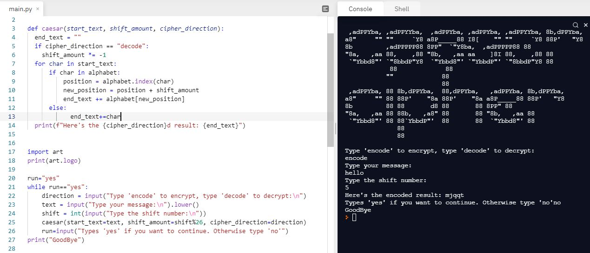

# Day-8

**Stay Motivated!**.  **Functions with Arguments and Caesar Cipher** were today's topic, wonderfully explain by [Dr.Angelea Yu](https://www.udemy.com/user/4b4368a3-b5c8-4529-aa65-2056ec31f37e/). It was amazing to have a brainstorm of all that I have learnt till date.

### What did I learn?

1. Parameters in functions ``` def function(a,b)```
2. Positional vs Keyword Arguments
3. Encryption and Decryption
4. [Cans of Paint](https://replit.com/@skandasharma/Cans-of-paint)
5. [Prime Number](https://replit.com/@skandasharma/Prime-Numbers)


## Project of the day

Happened to build a wonderful **Caesar Cipher Encryption** using functions and arguments. You can check out my code [here](https://replit.com/@skandasharma/caesar-cipher-Final)

##### Screenshot



# Conclusion

To conclude, I would thank my instructor for being such a wonderful teacher for coming up with a beautiful course. I would like to thank **MYSELF** for being _self-motivated_ throughout the lecture. 

### Suggestion

- For all those who can understand English in a fast pace and catch up what the instructor is trying to convey can choose to watch the video at **1.2x** speed which reduces the watch time and meanwhile you can keep the remaining time for practice.

##### Date - 13/4/2021