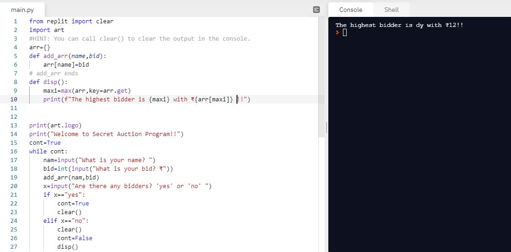

# Day-9

**Accountability Trick**.  **Dictionaries and Nesting** were today's topic, wonderfully explain by [Dr.Angelea Yu](https://www.udemy.com/user/4b4368a3-b5c8-4529-aa65-2056ec31f37e/). 

### What did I learn?

1. Dictionaries in Python
    ``` dic={"key":"value"}```
2. Key-Value Pairs
3. for loops in dictionaries
4. Nesting using lists and dictionaries
5. [Grading Students](https://replit.com/@skandasharma/Grading-Students)
6. [Travel Log](https://replit.com/@skandasharma/Travel-Log)

## Project of the day

Happened to build a wonderful **Secret Auction System** using Dictionaries. You can check out my code [here](https://replit.com/@skandasharma/blind-auction)

##### Screenshot



# Conclusion

To conclude, I would thank my instructor for being such a wonderful teacher for coming up with a beautiful course. I would like to thank **MYSELF** for being _self-motivated_ throughout the lecture. 

### Suggestion

- For all those who can understand English in a fast pace and catch up what the instructor is trying to convey can choose to watch the video at **1.2x** speed which reduces the watch time and meanwhile you can keep the remaining time for practice.

##### Date - 14/4/2021